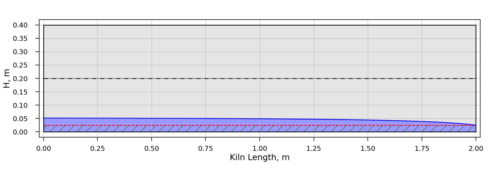
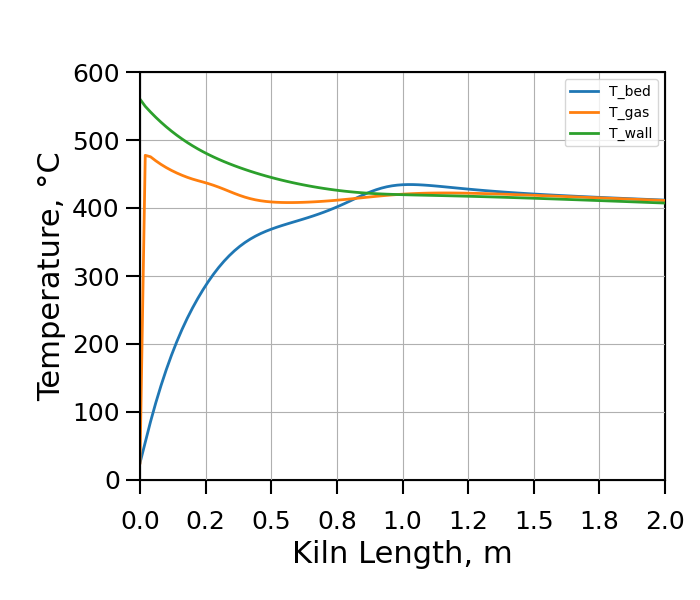
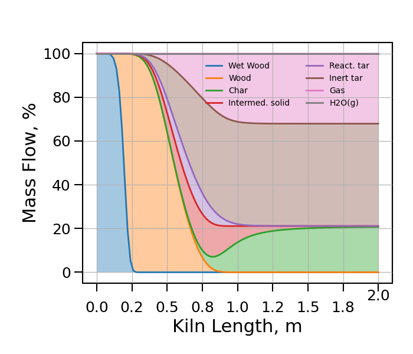
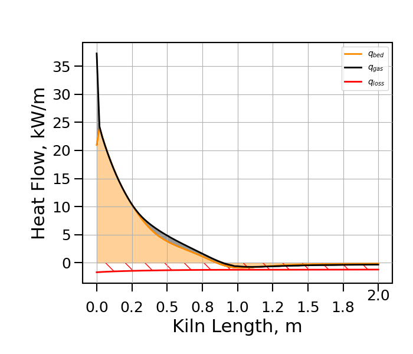

# rotaryPyrolysis
One dimensional numerical steady state simulation of biomass pyrolysis in externally heated rotary kilns.

Exemplary results, calculated with the code in this folder:

Bed Height:

Temperature profiles:

 

Concentration profiles:

Heat flux profiles:

**Tested/required module versions:**
* Anaconda3_2020.11
* numpy 1.19.2
* scipy 1.7.1
* matplotlib 3.4.3

# References

**Related research article:**

Mario Pichler, Bahram Haddadi, Christian Jordan, Hamidreza Norouzi, Michael Harasek, Influence of particle residence time distribution on the biomass pyrolysis in a rotary kiln, Journal of Analytical and Applied Pyrolysis 2021, 158, 105171, DOI: https://doi.org/10.1016/j.jaap.2021.105171

**Dataset:**

Mario Pichler, Bahram Haddadi, Christian Jordan, Hamidreza Norouzi, Michael Harasek, Dataset for the Simulated Biomass Pyrolysis in Rotary Kilns with varying Particle Residence Time Distributions, Mendeley Data, V1,  DOI: https://doi.org/10.17632/j3zm2xv53y.1

**Code DOI:**

